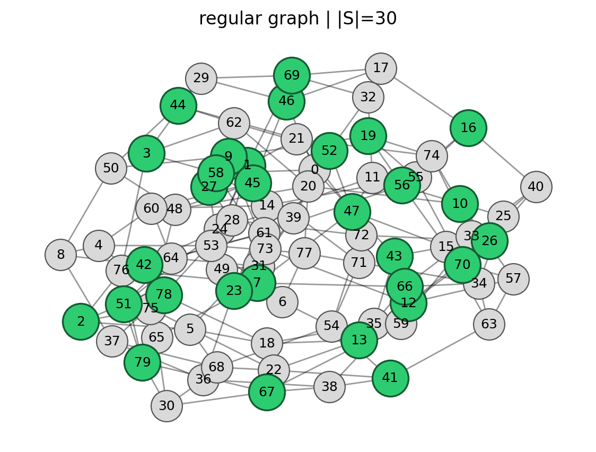
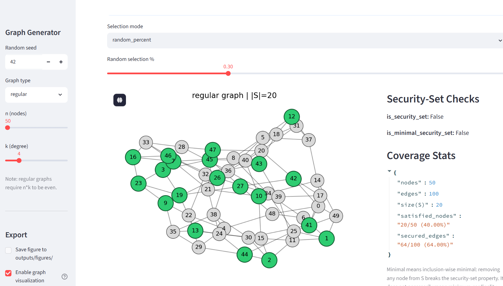

# Network Security Sets via Algorithmic Game Theory

> A Python framework for modeling, analyzing, and solving the **Network Security Set (NSS)** problem through four complementary Algorithmic Game Theory approaches.

---

## Overview

This repository presents a complete implementation of the **Network Security Set (NSS)** problem developed for the **Algorithmic Game Theory** course at the **Department of Mathematics and Computer Science (DeMaCS), University of Calabria**.

Rather than addressing the problem from a single perspective, the project investigates four complementary formulations based on Algorithmic Game Theory:

- **Strategic Games** – decentralized security decisions through learning dynamics.
- **Coalitional Games** – cooperative security using Shapley-value based node importance.
- **Planner Optimization** – centralized welfare-maximizing vendor assignment.
- **Mechanism Design** – truthful procurement of secure communication paths using VCG payments.

The repository combines theoretical models with practical software implementation through an interactive **Streamlit application**, command-line experiment runners, reproducible evaluations, and visualization tools.

---

## Objectives

The project aims to:

- Study the Network Security Set problem from multiple Algorithmic Game Theory perspectives.
- Compare decentralized, cooperative, centralized, and mechanism-design based solutions.
- Provide an interactive environment for experimenting with different graph models.
- Enable reproducible experiments through command-line runners.
- Visualize and validate security-set properties on real graph instances.

---

## Features

### Interactive Application

- Interactive Streamlit graphical interface
- Graph visualization and inspection
- Network Security Set validation
- Security statistics and coverage analysis
- Figure export support

### Algorithms

- Best Response Dynamics (BRD)
- Regret Matching (RM)
- Fictitious Play (FP)
- Monte Carlo Shapley-value approximation
- Build–Prune algorithm for minimal Network Security Set construction
- Welfare-maximizing planner assignment
- Min-Cost Flow optimization for limited capacities
- Vickrey–Clarke–Groves (VCG) mechanism

### Supported Graph Models

- Regular graphs
- Erdős–Rényi random graphs
- Barabási–Albert scale-free graphs

---

## Technologies

The project is implemented in Python and makes use of the following libraries and tools:

- **Python** – Core implementation
- **NetworkX** – Graph generation and analysis
- **NumPy** – Numerical computations
- **SciPy** – Optimization algorithms (Min-Cost Flow)
- **Matplotlib** – Graph visualization and figure export
- **Streamlit** – Interactive graphical user interface

## Repository Structure

```
agt-network-security/
│
├── app/                  Streamlit application
├── docs/
│   └── report/           Project report
├── experiments/          Reproducible experiment runners
├── outputs/              Generated experimental results
├── scripts/              Validation and utility scripts
├── src/
│   ├── graphs/           Graph generation algorithms
│   ├── security/         Network Security Set validation
│   ├── task1_strategic/  Strategic Game algorithms
│   ├── task2_coalitional/ Coalitional Game algorithms
│   ├── task3_planner/    Planner optimization
│   ├── task4_auction/    VCG auction mechanism
│   └── utils/            Shared utilities
│
├── README.md
├── requirements.txt
├── config.yaml
└── LICENSE
```

---

## Project Components

### Task 1 — Strategic Games

Implements decentralized decision-making through three learning dynamics:

- Best Response Dynamics (BRD)
- Regret Matching (RM)
- Fictitious Play (FP)

The objective is to study convergence behavior and equilibrium quality when individual nodes independently choose whether to participate in the Network Security Set.

---

### Task 2 — Coalitional Games

Implements cooperative security using:

- characteristic functions
- Monte Carlo Shapley-value approximation
- Build–Prune construction

The framework estimates each node's contribution to network security and constructs inclusion-wise minimal Network Security Sets.

---

### Task 3 — Planner Optimization

Models a centralized planner assigning vendors to secure network nodes.

Implemented scenarios include:

- Unlimited vendor capacities
- Limited capacities solved using Min-Cost Flow optimization

The objective is to maximize overall social welfare while respecting capacity constraints.

---

### Task 4 — Mechanism Design

Implements a truthful procurement mechanism using:

- shortest secure path computation
- VCG allocation
- VCG payment computation

The implementation guarantees incentive compatibility through truthful bidding.

---

## Installation

Create a virtual environment and install the required dependencies:

```bash
python -m venv .venv
pip install -r requirements.txt
```

---

## Running the Project

### Interactive Streamlit Interface

Launch the interactive graphical interface to generate graphs, validate Network Security Sets, visualize algorithms, and explore all four project tasks.

```bash
streamlit run app/ui_streamlit.py
```

The application allows users to:

- generate graphs,
- visualize Network Security Sets,
- validate solutions,
- inspect graph statistics,
- explore the four project tasks interactively.

### Command-Line Experiments

```bash
python experiments/run_task1_cli.py
python experiments/run_task2_cli.py
python experiments/run_task12_compare_cli.py
```

These scripts reproduce the experiments presented in the project report.

---

## Application Preview

The Streamlit application provides an interactive environment for generating graphs, validating Network Security Sets, visualizing algorithms, and exploring all four project tasks.

### Graph Visualization



### Security Statistics



## Experimental Evaluation

Experiments were conducted on:

- Regular graphs
- Erdős–Rényi graphs
- Barabási–Albert graphs

The evaluation analyzes:

- convergence behavior
- runtime
- Network Security Set validity
- inclusion-wise minimality
- solution quality
- social welfare
- VCG payments

All experiments can be reproduced using fixed random seeds.

---

## Documentation

The complete methodology, theoretical background, implementation details, and experimental results are available in the project report:

**[AGT Network Security Set Report (PDF)](docs/report/AGT_Network_Security_Set_Report.pdf)**

---

## Future Work

Potential extensions include:

- additional graph models
- larger-scale experimental evaluation
- approximation algorithms for large networks
- dynamic and temporal graph support
- distributed implementations
- performance optimization

---

## License

This project is released under the **MIT License**.

---

## Author

**Yaekob Beyene Yowhanns**

M.Sc. Artificial Intelligence and Computer Science

Department of Mathematics and Computer Science (DeMaCS)

University of Calabria